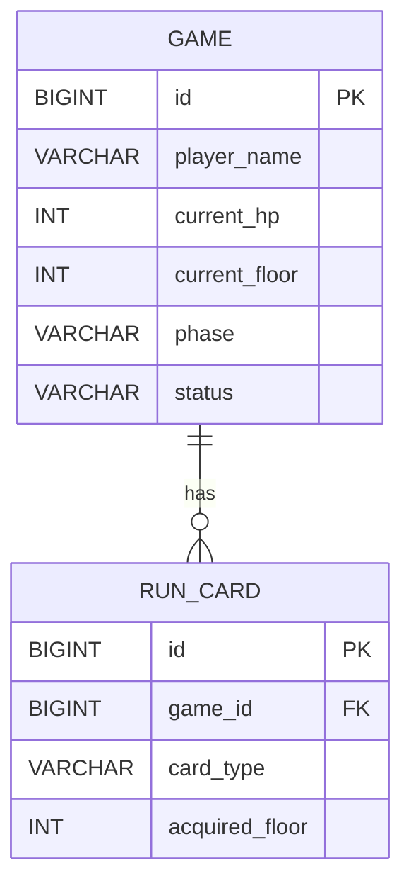

# Crimson Citadel

Spring Boot와 JPA를 이용해 게임의 생성, 진행 저장, 조회, 이름 수정, 삭제 기능을 구현한 프로젝트입니다.

## 기술 스택

- Java
- Spring Boot
- Spring Data JPA
- MySQL
- Lombok
- Bean Validation

## API 명세

| Method | URL | 설명 |
|---|---|---|
| GET | `/games` | 게임 목록 조회 |
| GET | `/games/{gameId}` | 게임 상세 조회 |
| POST | `/games` | 새 게임 생성 |
| PUT | `/games/{gameId}/progress` | 게임 진행 상태 저장 |
| PATCH | `/games/{gameId}` | 플레이어 이름 변경 |
| DELETE | `/games/{gameId}` | 게임 삭제 |

## 주요 응답

### 게임 목록 조회

`GET /games`

응답 예시:

```json
[
  {
    "id": 1,
    "playerName": "밤의 후계자",
    "currentFloor": 2,
    "currentHp": 84,
    "phase": "BATTLE",
    "status": "PLAYING"
  }
]
```

### 게임 상세 조회

`GET /games/{gameId}`

응답 예시:

```json
{
  "id": 1,
  "playerName": "밤의 후계자",
  "currentHp": 84,
  "currentFloor": 2,
  "phase": "BATTLE",
  "status": "PLAYING",
  "deck": [
    {
      "id": 12,
      "cardType": "STRIKE",
      "acquiredFloor": 0
    }
  ]
}
```

## ERD



## 주요 구현 내용

- 3 Layer Architecture 적용
- DTO를 이용한 API 요청/응답 분리
- Bean Validation 적용
- Spring Data JPA 기반 조회 및 저장
- 더티 체킹을 이용한 이름 수정
- 연관관계를 고려한 자식 엔티티 선삭제
